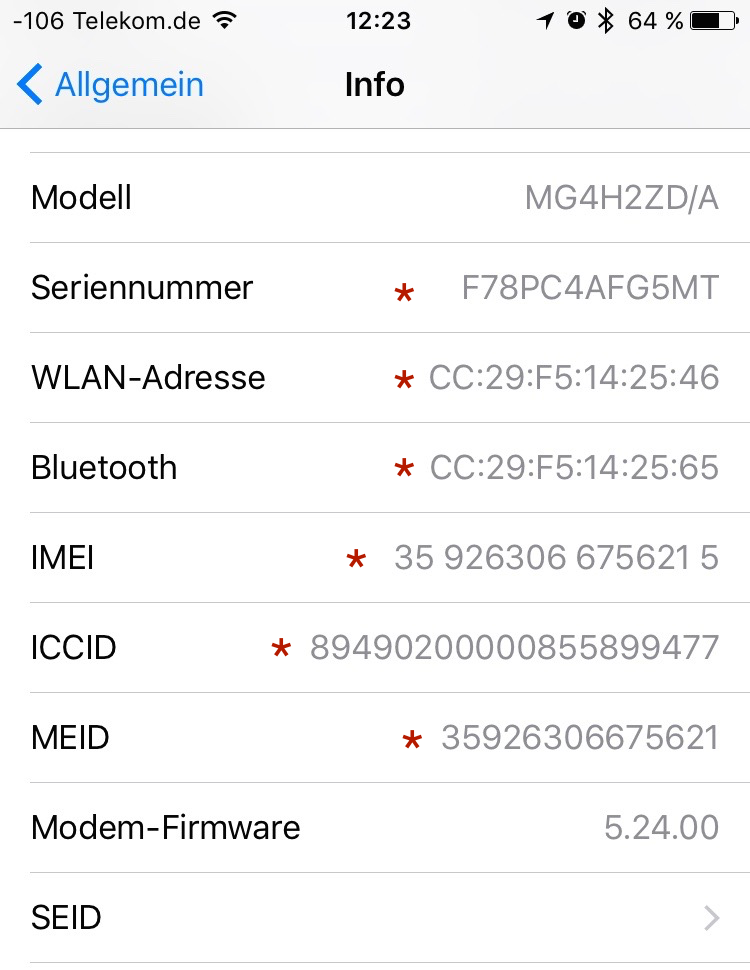
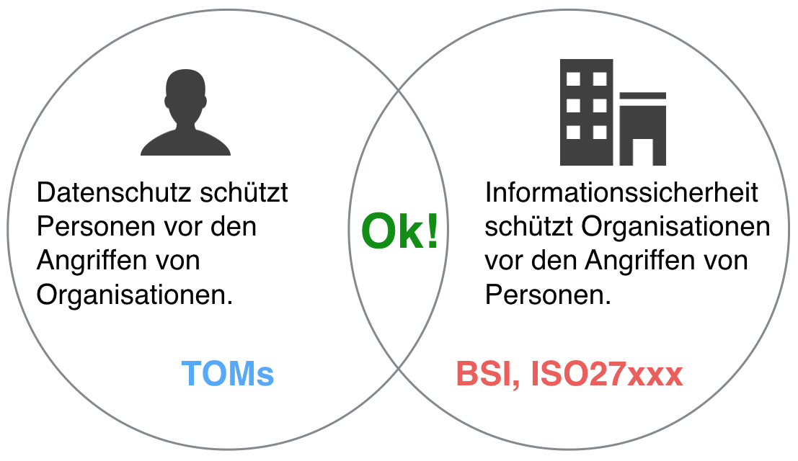
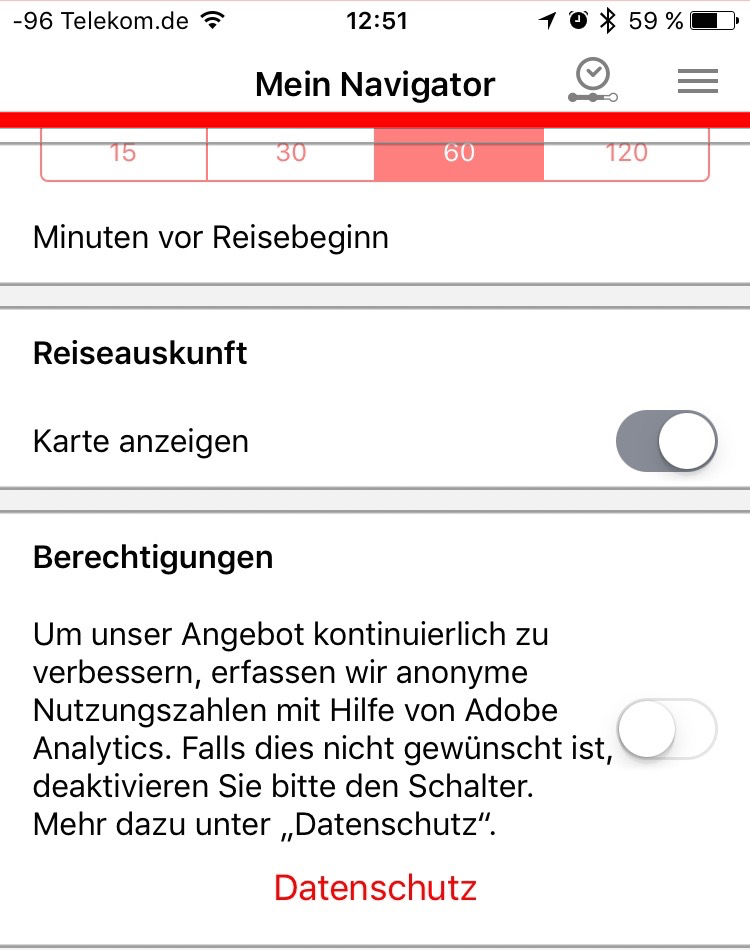

.. slideconf::
   :autoslides: True

..   :slide_classes: appear

.. only:: latex

  .. raw:: latex

     %%\renewcommand{\headrulewidth}{0pt}
     \fancyhead[L]{}
     \fancyhead[R]{
             \vspace{-1cm}
             \includegraphics[width=1.0cm]{dssyslogo.pdf}
         }

     \pagestyle{fancy}
     \fancyfoot[CEO]{\sffamily \tiny \vspace{0.28cm} ©2016 Dipl.-Inform. Karsten Schulz, Datenschutz.systems}

=============================
Datenschutz und Programmierer
=============================

* Warum sollte ich mich als Coder damit beschäftigen?
* Echt jetzt?
* Um welche Teile meiner Arbeit geht es?
* Welche 

.. only:: not slides

    Professionelle Programmierer, deren Produkte auch personenbezogene Daten verarbeiten, sollten sich im eigenen Interesse ab sofort mit dem Thema Datenschutz beschäftigen und damit sicherstellen, dass ihre Software auch in Zukunft noch benutzt werden darf. Am 25. Mai 2016 ist die EU-Datenschutz Grundverordnung (EU-DSGVO) in Kraft getreten, deren Vorschriften bei der Verarbeitung von personenbezogene Daten demnächst eingehalten werden müssen.

    Personenbezogene Daten sind beispielsweise Benutzernamen und -anschriften. Aber auch Login-Daten, E-Mail Adressen, Session-Cookies und sämtliche anderen Informationen, die eine natürliche Person identifizierbar machen. Nahezu jede Software verarbeitet in irgendeiner Form personenbezogene Daten.

    Das neue, europaweit geltende Gesetz enthält konkrete Vorgaben, die Einfluss auf die Gestaltung von Software haben. Der Betreiber der Software, also der Käufer oder Auftraggeber, ist verantwortlich dafür, dass die Software die Vorgaben EU-DSGVO einhält. Bei Verstoss droht Bußgeld.

    Für den professionellen Programmierer gibt es unter diesen Umständen nur eine logische Schlussfolgerung. Und die lautet: „Möchte ich künftig meine Software in der EU an den Mann bringen, muss sie EU-DSGVO-konform sein, sonst kauft sie keiner mehr.“ Schließlich möchte kein Kunde ein Bußgeld riskieren, nur weil der Programmierer die gesetzlichen Vorgaben nicht umgesetzt hat.

    Der Vortrag beleuchtet die EU-DSGVO aus dem Blickwinkel der Software-Entwickler und -Architekten. Neben einem fundierten Überblick, worum es überhaupt geht, werden auch konkrete Tipps und Tricks aus dem Umfeld der Python Programmierung gegeben. So wird beispielsweise anhand einer Django-App gezeigt, wie Systeme so zu gestalten sind, dass sie auch unter dem neuen Datenschutz-Recht in der EU im geschäftlichen Umfeld einsetzbar und damit an den Kunden zu bringen sind.

Vereinfachte Darstellung der EU-Datenschutz-Grundverordnung zum schnellen Überblick und Einstieg in die Materie.

.. ifslides::

    .. note::

        Bemerkenswert ist, dass die GVO nicht nur dazu da ist, personenbezogene Daten zu schützen, sondern
        auch dazu, den freien Datenverkehr zu fördern (ebenso wie die vorher geltende RL 95/46/EG).

.. ifnotslides::

    Wirtschaftliche Argumente für den Datenschutz
    =============================================

    Als Argument gegenüber den Geschäftsführungen einen ordentlichen Datenschutz umzusetzen, kann angeführt werden, dass Kunden bei gutem Datenschutz mehr Vertrauen in die Unternehmensprozesse haben und deshalb eher bereit sind, ihre Daten herzugeben. Bei schlechtem Datenschutz sinkt das Vertrauen und damit die Kundenbindung.

    Im EG 7 der EU-DSGVO wird genau dieser Punkt als wichtiger Aspekt dargestellt:

        „(7) Diese Entwicklungen erfordern einen soliden, kohärenteren und klar durchsetzbaren Rechtsrahmen im Bereich des Datenschutzes in der Union, da es von großer Wichtigkeit ist, eine Vertrauensbasis zu schaffen, die die digitale Wirtschaft dringend benötigt, um im Binnenmarkt weiter wachsen zu können. Natürliche Personen sollten die Kontrolle über ihre eigenen Daten besitzen. Natürliche Personen, Wirtschaft und Staat sollten in rechtlicher und praktischer Hinsicht über mehr Sicherheit verfügen.“

Ihr Referent
============

.. ifnotslides::

    Der Diplom-Informatiker Karsten Schulz ist GDD-zertifizierter
    Datenschutzexperte und Betriebswirt. Als bundesweit tätiger
    Datenschutzbeauftragter und -berater verfügt er über jahrelange Erfahrung in
    der effizienten Umsetzung von Datenschutz im Unternehmen. Darüber hinaus ist er
    Lehrbeauftragter der Fachhochschule Dortmund, Fachautor und Gutachter für die
    IHK Dortmund.

    Für die TÜV NORD Akademie hält er die Seminare „Datenschutz Cloud-Computing“,
    „Datenschutz Social Media“ und „Die EU-Datenschutz-Grundverordnung.“

.. rst-class:: referentenlogo

.. image:: _static/referent1.*
    :align: center
    :width: 100%

Grundsätze des Datenschutzes
============================

Sowohl heute im BDSG als auch ab dem 25. Mai 2018 in der kommenden EU-Datenschutz-Grundverordnung gilt das Verbot der Verarbeitung personenbezogener Daten mit Erlaubnisvorbehalt.

Deadline 25. Mai 2018
---------------------

Der Termin steht fest. Software, die heute geschrieben wird, sollte die Grundverordnung berücksichtigen.

Die EU-Datenschutzgrundverordnung
---------------------------------

*Verordnung des Europäischen Parlaments und des Rates zum Schutz natürlicher Personen bei der Verarbeitung personenbezogener Daten, zum freien Datenverkehr und zur Aufhebung der Richtlinie 95/46/EG (Datenschutz-Grundverordnung)*

Ab dem 25. Mai 2018 wird die EU-Datenschutz-Grundverordnung (EU-DSGVO) für alle Verarbeiter personenbezogener Daten angewendet, die in der EU ihre Produkte oder Dienstleistungen anbieten.

.. only:: not slides

    http://eur-lex.europa.eu/legal-content/DE/TXT/?uri=uriserv%3AOJ.L_.2016.119.01.0001.01.DEU&toc=OJ:L:2016:119:TOC

Was sind personenbezogene Daten?
--------------------------------

.. only:: slides

    * *Personenbezogene Daten* sind Einzelangaben über persönliche oder sachliche Verhältnisse einer bestimmten oder bestimmbaren natürlichen Person.
    * *Besondere Arten personenbezogener Daten* sind Angaben über rassische und ethnische Herkunft, politische Meinungen, religiöse oder philosophische / weltanschauliche Überzeugungen, Gewerkschaftszugehörigkeit, Gesundheit, Sexualleben, biometrische Daten

.. only:: not slides

    Mit *Daten* ist in diesem Zusammenhang die formalisierte Darstellung von
    Informationen gemeint, die für die Verarbeitung durch Menschen oder
    automatisierte Abläufe geeignet sind.

    *Personenbezogene Daten* sind Einzelangaben über persönliche oder sachliche
    Verhältnisse einer bestimmten oder bestimmbaren natürlichen Person.

    Die EU-DSGVO definiert in Art. 4 Nr. 1 personenbezogene Daten als: „*alle Informationen, die sich auf eine identifizierte oder identifizierbare natürliche Person (im Folgenden „betroffene Person“) beziehen; als identifizierbar wird eine natürliche Person angesehen, die direkt oder indirekt, insbesondere mittels Zuordnung zu einer Kennung wie einem Namen, zu einer Kennnummer, zu Standortdaten, zu einer Online-Kennung oder zu einem oder mehreren besonderen Merkmalen, die Ausdruck der physischen, physiologischen, genetischen, psychischen, wirtschaftlichen, kulturellen oder sozialen Identität dieser natürlichen Person sind, identifiziert werden kann*“

    *Besondere Arten personenbezogener Daten* sind nach § 3 Abs. 9 BDSG und Art. 9 EU-DSGVO Daten, die Angaben machen über:

    * rassische und ethnische Herkunft
    * politische Meinungen
    * religiöse oder philosophische / weltanschauliche Überzeugungen
    * Gewerkschaftszugehörigkeit
    * Gesundheit
    * Sexualleben
    * biometrische Daten

    Für die Verarbeitung dieser Art Daten werden hohe Ansprüche an die Schutzmaßnahmen gestellt, die die verantwortliche Stelle ergreifen muss.

    Die Verarbeitung der besonderen Kategorien personenbezogener Daten ist untersagt, es sei den, die betroffene Person hat **ausdrücklich** eingewilligt oder eine rechtliche Norm legitimiert die Verarbeitung.

Eine Unterscheidung der personenbezogenen Daten hinsichtlich ihrer privater oder geschäftlicher Natur findet nicht statt. Weder das BDSG noch die EU-DSGVO unterscheiden zwischen einer B2C- und B2B-Verarbeitung.

Beispiele für personenbezogene Daten
------------------------------------

* Namen
* E-Mail Adressen
* persönliche Durchwahl
* Anschrift mit Personenbezug, z. B. Personengesellschaft
* Tracking ID im Web oder Apps
* AD-ID (Advertising ID)
* Pseudonym im Web-Forum

.. nextslide::
    :increment:

* IP-Adresse
* IMEI (International Mobile Station Equipment Identity)
* MEID (Mobile Equipment Identifier)
* SEID (Secure Element ID Number)
* und andere UUIDs (Universally Unique Identifier

.. nextslide::
    :increment:

   Personenbezogene Daten in Apples iPhone unter iOS 10

Was ist Verarbeiten?
--------------------

*Verarbeiten* ist das Erheben, das Erfassen, die Organisation, das Ordnen, die Speicherung, die Anpassung oder Veränderung, das Auslesen, das Abfragen, die Verwendung, die Offenlegung durch Übermittlung, Verbreitung oder eine andere Form der Bereitstellung, den Abgleich oder die Verknüpfung, die Einschränkung, das Löschen oder die Vernichtung.

Python Code: Beispiele
======================

Sockets
-------

.. code-block:: python
    :emphasize-lines: 1,2,3

    import socket
    sock = socket.socket()
    sock.connect((address, port))
    
.. only:: not slides

    Beim Öffnen eines Sockets wird die IP-Adresse des Client-PCs an den Server übertragen. Die IP-Adresse ist ein personenbezogenes Datum und wird an jemand anderen übermittelt. Es ist ein datenschutzrelevanter Vorgang.
    
Requests
--------    
.. code-block:: python

    import requests
    requests.get('https://api.someserver.anywhere')
    
.. only:: not slides

    Natürlich werden nicht nur bei low-level Sockets, sondern bei jeder Netzwerkkommunikation personenbezogene Daten ausgetauscht.

Django 
--------    
.. code-block:: python

    from django.contrib.auth.models import User
    user = User.objects.create_user('john', 'lennon@thebeatles.com', 'johnpassword')    

.. only:: not slides

    Offensichtlich ist das Anlegen und Verwalten eines Benutzerkontos die Verarbeitung personenbezogener Daten.
    
.. code-block:: python

    from django.contrib.auth.models import User
    user = User.objects.create_user('john', 'lennon@thebeatles.com', 'johnpassword')    

.. only:: not slides

    Offensichtlich ist das Anlegen und Verwalten eines Benutzerkontos die Verarbeitung personenbezogener Daten.
    

Privacy by Design / Privacy by Default
======================================

Artikel 25 der EU DSGVO

.. code-block:: python

    SESSION_EXPIRE_AT_BROWSER_CLOSE = True
    # default: False

Whether to expire the session when the user closes their browser. See Browser-length sessions vs. persistent sessions.
     
    

Datenschutz versus Informationssicherheit
-----------------------------------------

   Überschneidungen der Maßnahmen bei Datenschutz und Informationssicherheit

Legitimation der Verarbeitung
=============================

Um zu beurteilen, ob personenbezogene Daten verarbeitet werden dürfen, helfen folgende Checklisten, die Rechtsgrundlage für die Verarbeitung zu ermitteln.

.. only:: slides

    .. hint:: Checklisten im Handout

.. only:: not slides

    Prüfen der Legitimation der Verarbeitung nach EU-DSGVO
    ------------------------------------------------------

    Falls keiner der Punkte zutreffen sollte, ist eine Verarbeitung der Daten
    nicht möglich.

    .. csv-table:: Checkliste Rechtmäßigkeit der pbDV nach EU-DSGVO
        :header: "","**Checkliste Rechtmäßigkeit der pbDV nach EU-DSGVO**",""
        :widths: 10,70,20

        "","*Eine der folgenden Voraussetzungen trifft zu*","*Gründe*"

        "☐","Die Verarbeitung ist erforderlich zur Erfüllung eines Vertrags mit der betroffenen Person","Art. 6 Abs. 1b, EG 44"
        "☐","Die Verarbeitung ist erforderlich für vorvertragliche Maßnahmen auf Anfrage der betroffenen Person","Art. 6 Abs. 1b, EG 44"
        "☐","Die Verarbeitung ist erforderlich zur Erfüllung einer rechtlichen Pflicht des für die Verarbeitung Verantwortlichen","Art. 6 Abs. 1c, EG 45"
        "☐","Die Verarbeitung ist erforderlich, weil lebenswichtige Interessen der betroffenen Person oder einer anderen natürlichen Person geschützt werden","Art. 6 Abs. 1d, EG 46"
        "☐","Die Verarbeitung ist erforderlich im öffentlichen Interesse oder in Ausübung öffentlicher Gewalt","Art. 6 Abs. 1e, EG 45"
        "☐","Berechtigtes Interesse, wenn schutzwürdige Interessen dem nicht entgegen stehen (insbesondere bei Kindern)","Art. 6 Abs. 1f, EG 47"
        "☐","Einwilligung der Person für einen oder mehrere Zwecke ist nachweisbar","Art. 7 Abs. 1, EG 42"

    Falls eine Verarbeitung möglich ist, müssen folgende Grundsätze der Verarbeitung nachweisbar eingehalten werden:

    .. csv-table:: Checkliste Grundsätze der pbDV
        :header: "","**Checkliste Grundsätze der pbDV**",""
        :widths: 10,70,20

        "","*Alle der folgenden Voraussetzungen treffen zu*","*Gründe*"

        "☐","Die Verarbeitung ist rechtmäßig","Art. 5 Abs. 1a"
        "☐","Die Verarbeitung erfolgt nach Treu und Glauben","Art. 5 Abs. 1a"
        "☐","Die Transparenzpflichten sind eingehalten","Art. 5 Abs. 1a, EG 58"
        "☐","Alle Informationen und Mitteilungen zur Verarbeitung sind leicht erreichbar","EG 39"
        "☐","Alle Informationen und Mitteilungen zur Verarbeitung sind verständlich und in klarer, einfacher Sprache verfasst","EG 39"
        "☐","Der Umfang der Verarbeitung ist dokumentiert","EG 39"
        "☐","Die Zwecke der Verarbeitung sind dokumentiert","EG 39"
        "☐","Es werden nur die für die Verarbeitung erforderlichen Daten verarbeitet","Art. 5 Abs. 1c"
        "☐","Die verarbeiteten Daten sind aktuell und sachlich richtig","Art. 5 Abs. 1d"
        "☐","Unrichtige Daten können unverzüglich gelöscht oder berichtigt werden","Art. 5 Abs. 1d"
        "☐","Es werden kürzestmögliche Löschfristen eingehalten","Art. 5 Abs. 1e"
        "☐","Die Daten werden vor unbefugter und unrechtmäßiger Verarbeitung geschützt","Art. 5 Abs. 1f"
        "☐","Die Daten werden vor unbeabsichtigter Zerstörung und Schädigung geschützt","Art. 5 Abs. 1f"
        "☐","Die vorgenannte Maßnahmen können nachgewiesen werden","Art. 5 Abs. 2"

Tracking von Personen
---------------------

.. only:: not slides

    Das Erstellen von pseudonymen Nutzungsprofilen ist in Grenzen erlaubt. § 15 TMG Abs. 3:

    „*(3) Der Diensteanbieter darf für Zwecke der Werbung, der Marktforschung oder zur bedarfsgerechten Gestaltung der Telemedien Nutzungsprofile bei Verwendung von Pseudonymen erstellen, sofern der Nutzer dem nicht widerspricht. Der Diensteanbieter hat den Nutzer auf sein Widerspruchsrecht im Rahmen der Unterrichtung nach § 13 Abs. 1 hinzuweisen.*“

    Tracking muss in der Datenschutzerklärung deklariert werden. In der Datenschutzerklärung muss ausserdem dargestellt werden, dass der Nutzer widersprechen und wie sich der Nutzer vom Tracking abmelden kann („Opt-Out“ laut § 13 TMG ). Auf diese Möglichkeit ist vor Beginn des Trackings hinzuweisen. Alternativ kann er beim ersten Besuch aufgefordert werden, in das Tracking einzuwilligen („Opt-In“ laut E-Privacy-Richtlinie Nr. 2009/136/EG, auch „Cookie-Richtlinie)

    Für Apps gelten die gleichen Vorgaben wie für Webseiten.

   Widerspruchsmöglichkeit gegen Tracking in der Bahn App

Beispiele für verhängte Bußgelder
---------------------------------

Die Datenschutzaufsichten haben beispielsweise folgende Bußgelder verhängt:

* 35 Lidl-Vertriebsgesellschaften wegen der Ausspähung ihrer Mitarbeiter Bußgelder zwischen 10.000 und 110.000 € auferlegt. Die Zahlungen summierten sich auf insgesamt 1,46 Millionen €.
* € 1.300.000,00 (Debeka-Krankenversicherungsverein a.G: vier Mitarbeiter hatten rechtswidrig Datensätze von Anwärtern im öffentlichen Dienst erworben und genutzt)
* € 1.120.000,00 (Deutsche Bahn AG: u.a. zur Korruptionsbekämpfung wurden die Daten einer großen Zahl von Mitarbeitern und deren Angehörigen mit den Daten von Lieferanten abgeglichen)

.. nextslide::
    :increment:

* € 200.000,00 (Hamburger Sparkasse, HASPA: verdeckte psychologische Analyse von Kontendaten zu Profilingzwecken, Datenweitergabe an Handelsvertreter zu Marketingzwecken)
* € 120.000,00 (Postbank: Transfer von Kontendaten an 4.000 Handelsvertreter zu Marketingzwecken)
* € 60.000,00 (EasyCash: datenschutzwidriger Datentransfer an Konzernunternehmen)

.. nextslide::
    :increment:

* € 54.000,00 (EuropCar: verdeckte GPS Ortung in Mietwagen)
* € 50.000,00 (Nutzung von GoogleAnalytics ohne angemessene Datenschutzmaßnahmen, DPA Bayern prüfte die Websites von 13.000 Unternehmen von verhängte Geldbußen von bis zu € 50.000,00)

Haftung, Sanktionen und Bußgelder nach EU-DSGVO
===============================================

Haftungsrisiken
---------------

Grundsätzliche Forderung (EG 74) gegenüber dem Verantwortlichen:

* Geeignete und wirksame Schutzmaßnahmen treffen
* Maßnahmen *nachweisen* können
* Verarbeitung im Einklang mit der EU-DSGVO
* Art, Umfang, Umstände und Zweck der Verarbeitung und das Risiko berücksichtigen

Haftung und Schadenersatz (Art. 82)
-----------------------------------

* Schadenersatz gilt für materiellen und immateriellen Schaden
* Mehrere Verarbeiter haften gesamtschuldnerisch
* Anspruch besteht gegenüber Verantwortlichen und Auftragsverarbeitern
* keine Haftung, wenn Verantwortlicher oder Auftragsverarbeiter nachweist, dass er keine Verantwortung für Schaden trägt

EG 146
    Nachweispflicht für Nicht-Verschulden liegt beim Verantwortlichen oder Auftragsverarbeiter,
    gesamtschuldnerische Haftung von Verantwortlichem und Auftragsverarbeiter

Befugnisse der ASBs (Art. 58 Abs. 1 EU-DSGVO)
---------------------------------------------

* Untersuchungsbefugnis
* Genehmigungen (z. B. Vertragsklauseln)
* Beratung
* Abhilfemaßnahmen

Abhilfemaßnahmen (Art. 58 Abs. 2 EU-DSGVO)
-------------------------------------------

* Verwarnung
* Anweisung
* Fristsetzung bis zur Abhilfe
* Benachrichtigung gegenüber betroffener Person anweisen
* Einschränkung oder Verbot der Verarbeitung
* Berichtigung oder Löschung anordnen
* Widerruf der Zertifizierung
* Geldbuße
* Übermittlung an Drittland unterbinden

Geldbußen (Art. 83 EU-DSGVO)
-----------------------------

.. attention:: Geldbußen sollen in jedem Einzelfall wirksam, verhältnismäßig und abschreckend sein (Art. 83 Abs. 1)

.. nextslide::
    :increment:

* Geldbußen zusätzlich zu oder anstelle von Sanktionen
* Art, Schwere und Dauer des Verstoßes sowie Anzahl der Betroffenen maßgeblich
* Verschärfend: Vorsätzlichkeit und Fahrlässigkeit
* Mildernd: Maßnahmen zur Minderung des Schadens
* Mildernd: technische Maßnahmen nach Stand der Technik zum Schutz der Daten
* Mildernd: organisatorische Maßnahmen zum Schutz der Daten

.. nextslide::
    :increment:

Für Sanktionsrahmen werden berücksichtigt:

* Frühere Verstöße
* finanzielle Vorteile oder vermiedene Verluste
* betroffene Kategorien personenbezogener Daten
* Wie ASB Kenntnis vom Verstoß erhalten hat
* Umfang der Zusammenarbeit mit ASB
* Einhaltung von BCRs (Art. 40) oder Zertifizierungsverfahren (Art. 42)
* jeglichen anderen erschwerenden oder mildernden Umstände

.. nextslide::
    :increment:

.. only:: slides

    Bußgeld kann je nach Schwere des Verstoßes

    * 2 % des globalen Umsatzes oder € 10.000.000,- bis
    * 4 % des globalen Umsatzes oder € 20.000.000,- betragen.

    .. hint:: Details im Handout.

.. only:: not slides

    Geldbuße bis 10.000.000 €
    -------------------------

    Geldbußen von 10.000.000 € oder 2 % des globalen Umsatzes des Vorjahres bei Verstößen gegen:

    * Artikel 8 Bedingungen für die Einwilligung eines Kindes in Bezug auf Dienste der Informationsgesellschaft
    * Artikel 11 Verarbeitung, für die eine Identifizierung der betroffenen Person nicht erforderlich ist
    * Artikel 25 Datenschutz durch Technikgestaltung und durch datenschutzfreundliche Voreinstellungen
    * Artikel 26 Gemeinsam für die Verarbeitung Verantwortliche
    * Artikel 27 Vertreter von nicht in der Union niedergelassenen Verantwortlichen oder Auftragsverarbeitern
    * Artikel 28 Auftragsverarbeiter
    * Artikel 29 Verarbeitung unter der Aufsicht des Verantwortlichen oder des Auftragsverarbeiters
    * Artikel 30 Verzeichnis von Verarbeitungstätigkeiten
    * Artikel 31 Zusammenarbeit mit der Aufsichtsbehörde
    * Artikel 32 Sicherheit der Verarbeitung
    * Artikel 33 Meldung von Verletzungen des Schutzes personenbezogener Daten an die Aufsichtsbehörde
    * Artikel 34 Benachrichtigung der von einer Verletzung des Schutzes personenbezogener Daten betroffenen Person
    * Artikel 35 Datenschutz-Folgenabschätzung
    * Artikel 36 Vorherige Konsultation
    * Artikel 37 Benennung eines Datenschutzbeauftragten
    * Artikel 38 Stellung des Datenschutzbeauftragten
    * Artikel 39 Aufgaben des Datenschutzbeauftragten
    * Artikel 42 Zertifizierung
    * Artikel 43 Zertifizierungsstellen

    Geldbuße bis 20.000.000 €
    -------------------------

    Geldbußen von 20.000.000 € oder 4 % des globalen Umsatzes des Vorjahres bei Verstößen gegen:

    * Artikel 5 Grundsätze für die Verarbeitung personenbezogener Daten
    * Artikel 6 Rechtmäßigkeit der Verarbeitung
    * Artikel 7 Bedingungen für die Einwilligung
    * Artikel 9 Verarbeitung besonderer Kategorien personenbezogener Daten
    * Artikel 12 Transparente Information, Kommunikation und Modalitäten für die Ausübung der Rechte der betroffenen Person
    * Artikel 13 Informationspflicht bei Erhebung von personenbezogenen Daten bei der betroffenen Person
    * Artikel 14 Informationspflicht, wenn die personenbezogenen Daten nicht bei der betroffenen Person erhoben wurden
    * Artikel 15 Auskunftsrecht der betroffenen Person
    * Artikel 16 Recht auf Berichtigung
    * Artikel 17 Recht auf Löschung ("Recht auf Vergessenwerden")
    * Artikel 18 Recht auf Einschränkung der Verarbeitung
    * Artikel 19 Mitteilungspflicht im Zusammenhang mit der Berichtigung oder Löschung personenbezogener Daten oder der Einschränkung der Verarbeitung
    * Artikel 20 Recht auf Datenübertragbarkeit
    * Artikel 21 Widerspruchsrecht
    * Artikel 22 Automatisierte Entscheidungen im Einzelfall einschließlich Profiling
    * Artikel 44 Allgemeine Grundsätze der Datenübermittlung
    * Artikel 45 Datenübermittlung auf der Grundlage eines Angemessenheitsbeschlusses
    * Artikel 46 Datenübermittlung vorbehaltlich geeigneter Garantien
    * Artikel 47 Verbindliche interne Datenschutzvorschriften
    * Artikel 48 Nach dem Unionsrecht nicht zulässige Übermittlung oder Offenlegung
    * Artikel 49 Ausnahmen für bestimmte Fälle
    * Artikel 85 Verarbeitung und Freiheit der Meinungsäußerung und Informationsfreiheit
    * Artikel 86 Verarbeitung und Zugang der Öffentlichkeit zu amtlichen Dokumenten
    * Artikel 87 Verarbeitung der nationalen Kennziffer
    * Artikel 88 Datenverarbeitung im Beschäftigungskontext
    * Artikel 89 Garantien und Ausnahmen in Bezug auf die Verarbeitung zu im öffentlichen Interesse liegenden Archivzwecken, zu wissenschaftlichen oder historischen Forschungszwecken und zu statistischen Zwecken
    * Artikel 90 Geheimhaltungspflichten
    * Artikel 91 Bestehende Datenschutzvorschriften von Kirchen und religiösen Vereinigungen oder Gemeinschaften
    * Nichtbefolgen einer Anweisung der ASB oder Nichtgewährung des Zugangs (Artikel 83 Abs. 5e)

Pflichten des Verantwortlichen nach EU-DSGVO
============================================

* Informationspflicht bei

    * Erhebung bei betroffener Person (Art. 13)
    * Erhebung nicht bei der betroffenen Person (Art. 14)
    * Zweckänderung (Art. 13 Abs. 3 und Art 14 Abs. 4)
* Datenschutz by design / by default  (Art. 25)
* Durchführung von Datenschutz-Folgenabschätzung (Art. 35)

Organisationspflichten des Verantwortlichen
-------------------------------------------

.. only:: slides

    .. hint:: Checkliste im Handout

.. only:: not slides

    .. csv-table:: Checkliste DS-Organisation und -dokumentation
       :header: "","Prüffrage","Grund"
       :widths: 10,45,45

        "☐","Verwalten von Einwilligungen","EGs: 32, 38, 42, 43, 171;  Art.: 4 Nr. 11, 7, 8, 9, 22 Abs. 2c"
        "☐","Verwalten von Widerrufen","EG 65; Art.: 7 Abs. 3, 17 "
        "☐","Kategorien betroffener Personen dokumentieren","EG 81; Art.: 28 Abs. 3, 30 Abs. 1c, 33 Abs. 3a,"
        "☐","Kategorien personenbezogener Daten dokumentieren","EGs: 51 - 54; Art.: 9, 14, 15, 30 Abs. 1c, 30 Abs. 5, 33 Abs. 3a, 35 Abs. 3b, 83 Abs. 2g"
        "☐","Falls Auftragsverarbeiter: Kategorisieren der Tätigkeiten für Verantwortliche","Art.: 24 Abs. 2, 28 Abs. 4, 30 Abs. 1, 30 Abs. 2, 35 Abs. 6, 60 Abs. 10 "
        "☐","Übermittlungen dokumentieren","EGs: 48, 101, 102, 110 - 115; Art.: 13 Abs. 1f, 14 Abs. 1f, 15 Abs. 2, 30 Abs. 1e, 30 Abs. 2c, 44 - 50"
        "☐","Auskunftsprozess an betroffene Personen gestalten","EGs: 39, 63, 64; Art.: 13 Abs. 2b, 14 Abs. 2c, 15"
        "☐","Auskunftsprozess an die anfragende ASB gestalten","EGs: 82, 84, 94; Art.: 30 Abs. 4, 31, 33 Abs. 1, 36, Art. 37 Abs. 7, 39 Abs. 1d"
        "☐","Meldepflicht bei Verletzung des Schutzes personenbezogener Daten erfüllen (fristgerechte Reaktionen ermöglichen)","EGs: EG 85 - 88; Art.: 4 Nr. 12, 33, 34, "
        "☐","Management der technischen und organisatorischen Maßnahmen (Festlegung, Umsetzung, Evaluieren, ggfs. Aktualisierung)","EGs: 29, 71, 78, 83; Art.: 4 Nr. 5, 5 Abs 1e, 5 Abs. 1f, 24 Abs. 1, 25, 30 Abs. 1g, 30 Abs. 2d, 32, 34 Abs. 3"
        "☐","Interne Melderoutine an DSB für Datenschutz-Folgenabschätzung etablieren","EGs: 84, 89 - 92, 94, 95; Art.: 35, 36, 39 Abs. 1c, 57 Abs. 1k"

Die wichtigsten Betroffenenrechte nach EU-DSGVO
===============================================

* Auskunftsrecht (Art. 15)
* Recht auf Berichtigung (Art. 16)
* Recht auf Löschung („Recht auf Vergessenwerden“) (Art. 17)
* Löschung öffentlicher Daten („Vergessen“) (Art. 17 Abs. 2)
* Recht auf Einschränkung der Verarbeitung (Art. 18)
* Recht auf Datenübertragbarkeit „Datenportabilität“ (Art. 20)

